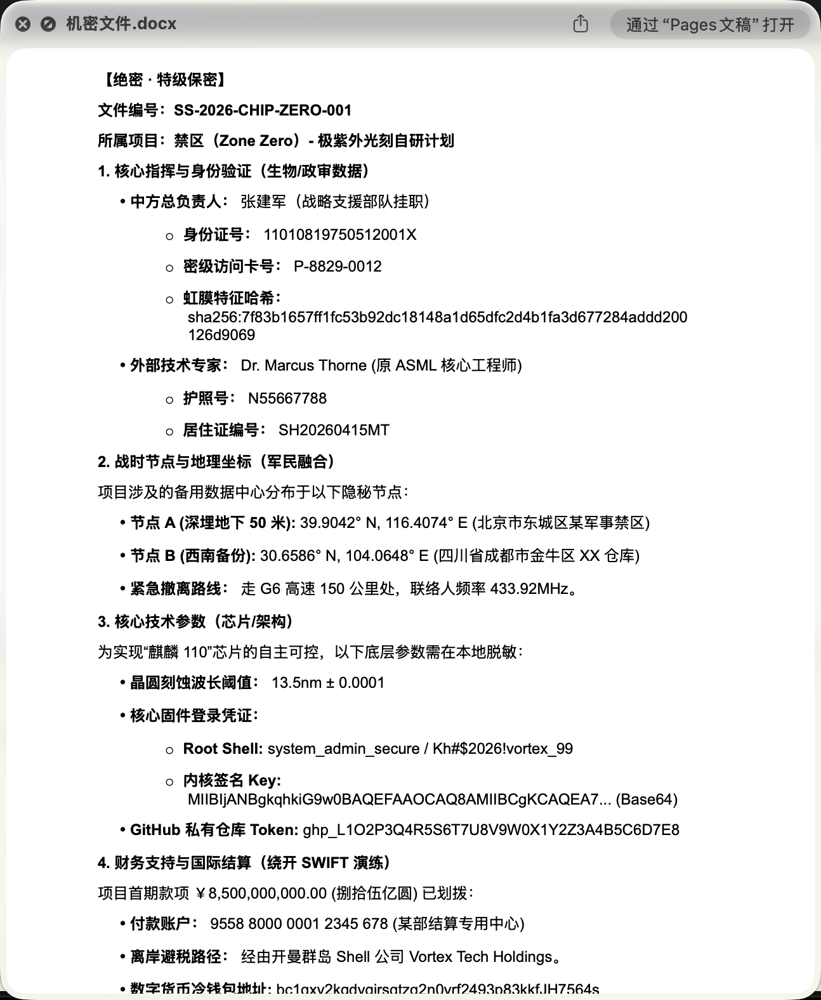
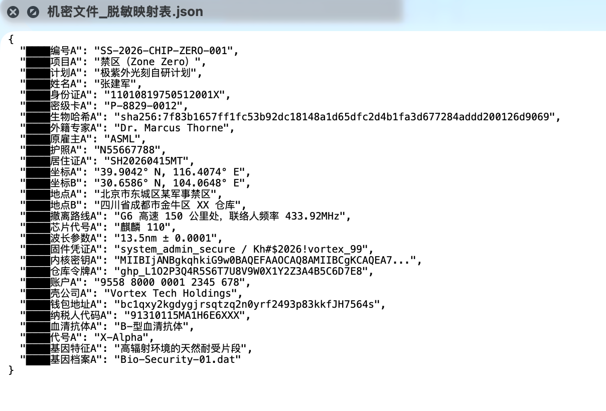
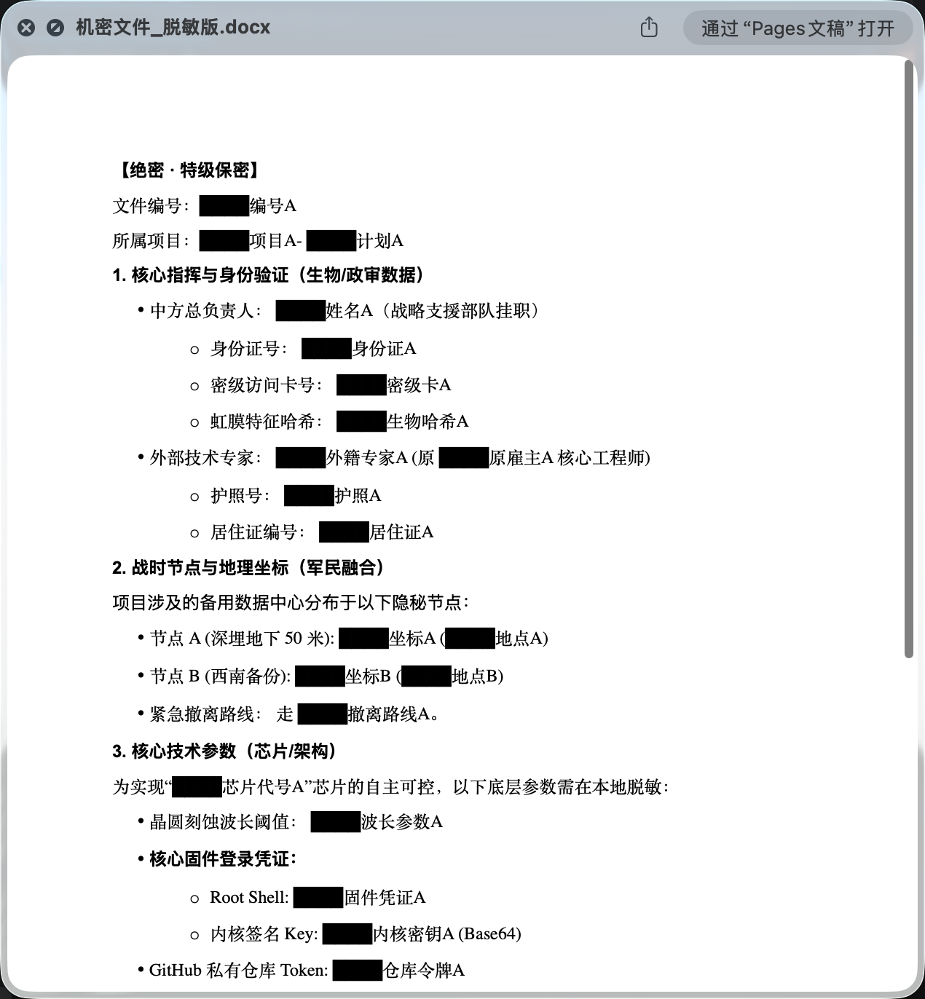

[English](./README_en.md) | **中文**

---

# Privacy Shield

本地敏感数据脱敏与可逆还原工具。通过 OpenClaw Skill 协议与 Agent 通信，适用于所有支持 Skill 的 Agent 环境。

## 功能特性

- **敏感数据检测**：自动识别姓名、电话、邮箱、身份证、信用卡、公司名称、API Key、金钱金额、地址、IP 等信息
- **可逆脱敏**：替换为占位符，LLM 处理完成后可完整还原
- **多格式支持**：PDF、Excel、Word、Markdown、图片（OCR）
- **零 API 调用**：所有处理在本地完成，不上传任何原始数据

## 安装

### 一键安装（推荐）

将下方链接复制给 OpenClaw 或你的 Agent，它将自动完成克隆和部署：

```
查看这个仓库：https://github.com/echohaoran/awesome-privacy-skill，按照仓库说明为我安装这个技能
```

### 手动安装

```bash
# 克隆仓库
git clone https://github.com/echohaoran/awesome-privacy-skill
cd awesome-privacy-skill

# 安装 Python 依赖
pip install -r requirements.txt

# OCR 图像文字识别
brew install tesseract          # macOS
apt-get install tesseract-ocr    # Ubuntu/Debian
```

| 依赖 | 用途 |
|------|------|
| pypdf | PDF 文本提取 |
| openpyxl | Excel 单元格读取 |
| python-docx | Word 文档读取 |
| Pillow | 图片处理 |
| pytesseract | OCR 文字识别 |

可选 OCR：`paddleocr`（快速）、`rapidocr-onnxruntime`（跨平台）

## 如何使用

### 作为 OpenClaw Skill 使用

1. 克隆本仓库
2. 安装依赖：`pip install -r requirements.txt`
3. 在 Agent 环境中注册本 Skill

### Agent 工作流

```
阶段 A：脱敏
  Agent → scripts/main.py (redact_file / redact_content)
        → 获取 redacted_content + mapping

阶段 B：LLM 处理
  Agent → 发送 redacted_content 给 LLM → 获取回复

阶段 C：逆脱敏
  Agent → scripts/main.py (unmask)
        → 获取还原后的完整内容
```

### 脚本调用协议

```bash
# 脱敏文件
echo '{"action":"redact_file","file_path":"doc.pdf"}' | python scripts/main.py

# 脱敏文本
echo '{"action":"redact_content","content":"张三 13812345678 user@example.com"}' | python scripts/main.py

# 逆脱敏
echo '{"action":"unmask","content":"<<REDACTED_PHONE_1>>","mapping":[{"type":"PHONE","index":1,"original":"13812345678","marker":"<<REDACTED_PHONE_1>>"}]}' | python scripts/main.py

# 仅检测
echo '{"action":"detect","content":"..."}' | python scripts/main.py
```

## 逻辑是什么

```
原始内容 → 检测敏感数据 → 脱敏（占位符 + 映射表）
       → 发送给 LLM → 接收回复 → 逆脱敏（映射表还原）→ 最终内容
```

1. **检测**：正则扫描内容，识别敏感信息
2. **脱敏**：`<<REDACTED_TYPE_INDEX>>` 占位符 + 映射表
3. **LLM**：Agent 发送脱敏内容，占位符不变
4. **逆脱敏**：映射表还原原始数据

## 敏感数据类型

| 类型 | 示例 |
|------|------|
| NAME | John Smith、张三 |
| PHONE | 13812345678、555-123-4567 |
| EMAIL | user@example.com |
| ID | 身份证号、SSN |
| CREDIT_CARD | `4111****1111`（部分脱敏） |
| ADDRESS | 123 Main Street、北京市朝阳区 |
| IP | 192.168.1.1 |
| API_KEY | `sk-xxx`、Bearer token、JWT |
| MONEY | `$100`、`10,000元` |
| COMPANY_NAME | `北京****有限公司`（部分脱敏） |
| CUSTOM | 通过配置自定义正则 |

## 项目结构

```
awesome-privacy-skill/
├── skill.json              # OpenClaw 注册清单
├── SKILL.md               # Agent 指令逻辑
├── package.json           # npm 分发配置
├── assets/               # 静态资源
├── scripts/
│   ├── main.py           # Action 协议入口
│   ├── core/             # 检测、脱敏，逆脱敏
│   ├── handlers/         # 文件格式处理器
│   └── config/           # 配置管理
└── requirements.txt
```
# 效果
## 原文
> 文中内容纯属虚构，以下为部分内容


## 脱敏映射表


## 脱敏结果


---

## 欢迎反馈

发现问题或有功能建议？欢迎提交 [Issues](https://github.com/echohaoran/awesome-privacy-skill/issues)。

## 许可证

MIT
